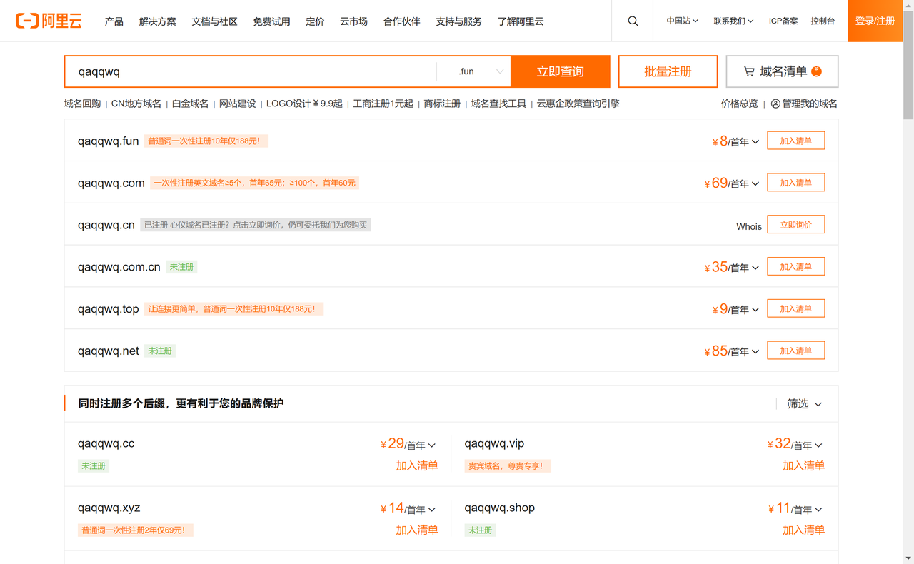

## 使用方法

- 访问 openai api 时，将 "api.openai.com" 换成你的自定义域名，例如

    ```javascript
    const host = 'YOUR DOMAIN'
    const url = `https://${host}/v1/chat/completions`
    ```

- 可参考 [OPENAI API 官方文档](https://platform.openai.com/docs/api-reference/chat)
 
  [官方文档中文翻译](https://linlin00.feishu.cn/docx/Fupxd8fIioGToIxv6Tacz4XbnBf)（部分过时，仅供参考）


- 在其他 chatgpt 项目中，可以将变量 "OPENAI_API_BASE_URL" 设置为你的域名

## 要求

一个域名（无需备案），没有的话可以在阿里云上买一个几块钱一年的


## 部署

1. 点击一键部署按钮

   [](https://vercel.com/new/clone?repository-url=https%3A%2F%2Fgithub.com%2Fsviphaige%2Fvercel-proxy-openai&project-name=vercel-proxy-openai&repository-name=vercel-proxy-openai&root-directory=src)

有问题可以 [在此](https://github.com/sviphaige/vercel-proxy-openai/issues) 留言
